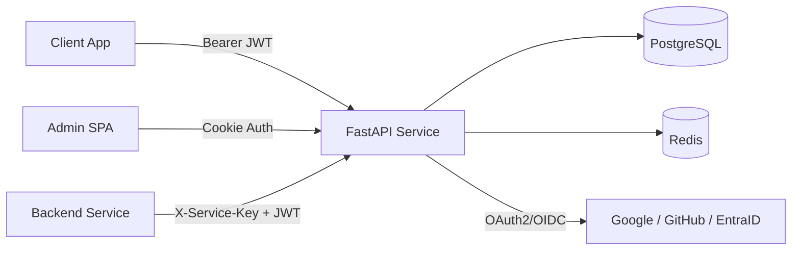
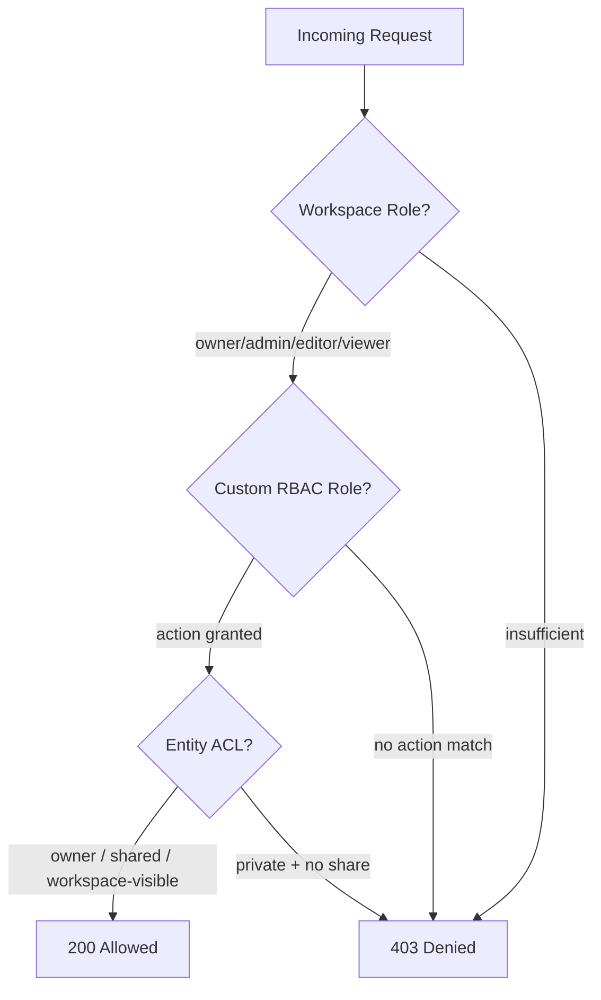

# Sentinel Auth


A lightweight authentication, workspace management, and entity-level permissions service. Built for teams that need batteries-included SSO-first identity with fine-grained authorization. Ships with an Admin UI, Python SDK, and JS/React SDK.

## Status

[](https://github.com/sidxz/DIS/actions/workflows/ci.yml)
[](https://sidxz.github.io/DIS/)
[](https://ghcr.io/sidxz/sentinel)
[](https://www.python.org/)
[](https://fastapi.tiangolo.com/)
[](https://www.postgresql.org/)
[](https://redis.io/)

## Capabilities

- **SSO-first authentication** via OAuth2/OIDC with PKCE (Google, GitHub, Microsoft EntraID, any OIDC provider).
- **Three-tier authorization** — workspace roles (JWT claims), custom RBAC roles (DB), and entity ACLs (Zanzibar-style).
- **Token lifecycle** with RS256 JWTs, refresh rotation, reuse detection, and Redis denylist revocation.
- **Workspace isolation** — users, groups, roles, and permissions are scoped per workspace.
- **Admin panel** — React SPA with full CRUD, audit logs, CSV import/export, and role management.
- **Python SDK** — pip-installable `sentinel-auth-sdk` with middleware, FastAPI dependencies, and HTTP clients.
- **JS/React SDK** — `@sentinel-auth/js`, `@sentinel-auth/react`, and `@sentinel-auth/nextjs` on npm. PKCE auth flow, token management, auth-aware fetch, React hooks, and Next.js Edge Middleware.
- **Client & service app management** — register frontend apps (redirect URI allowlist) and backend services (API keys) via the admin panel.
- **JWKS endpoint** — `/.well-known/jwks.json` for automatic key discovery by consuming services.
- **Security hardened** — rate limiting, CORS, HSTS, CSP, trusted hosts, session encryption, and a comprehensive pentest suite.

## Documentation

Full documentation at [sidxz.github.io/Sentinel/](https://sidxz.github.io/Sentinel/)

## Architecture at a glance



## Authorization model



| Tier | Mechanism | Granularity | Example |
|------|-----------|-------------|---------|
| **Workspace Roles** | JWT claims | Coarse | "Is user an editor in this workspace?" |
| **Custom RBAC** | DB roles + actions | Action-level | "Can user export reports?" |
| **Entity ACLs** | Zanzibar-style DB | Per-resource | "Can user edit document X?" |

## Quick start

### Docker (recommended)

```bash
# Create project directory and generate JWT keys
mkdir sentinel && cd sentinel
mkdir -p keys
openssl genrsa -out keys/private.pem 2048
openssl rsa -in keys/private.pem -pubout -out keys/public.pem

# Download config template and compose file
curl -fsSL https://raw.githubusercontent.com/sidxz/daikon-sentinel/main/.env.prod.example -o .env
curl -fsSL https://raw.githubusercontent.com/sidxz/daikon-sentinel/main/docker-compose.prod.yml -o docker-compose.prod.yml

# Fill in .env (database passwords, session secret, OAuth credentials, admin email)
# Then start everything:
docker compose -f docker-compose.prod.yml up -d
```

The service is available at `http://localhost:9003` with interactive API docs at `/docs` and the admin panel at `/admin`.

### From source (contributors)

```bash
git clone <repo-url> identity-service && cd identity-service
cp .env.example .env
make setup    # generates keys, installs deps, starts Postgres + Redis
make start    # starts the service on :9003
make admin    # starts the admin panel on :9004
make seed     # (optional) load test data
```

### Next steps

1. Configure an OAuth provider (Google is easiest) in your `.env`.
2. Sign in to the **admin panel** to create your first user.
3. Register a **client app** (redirect URI allowlist for your frontend).
4. Register a **service app** (API key for your backend).

See the [Getting Started guide](https://sidxz.github.io/Sentinel/getting-started/) for the full walkthrough.

## SDK usage

### Python

```bash
pip install sentinel-auth-sdk
```

```python
from fastapi import FastAPI, Depends
from sentinel_auth.middleware import JWTAuthMiddleware
from sentinel_auth.dependencies import get_current_user, require_role
from sentinel_auth.types import AuthenticatedUser

app = FastAPI()
app.add_middleware(
    JWTAuthMiddleware,
    jwks_url="http://localhost:9003/.well-known/jwks.json",
)

@app.get("/things")
async def list_things(user: AuthenticatedUser = Depends(get_current_user)):
    return await fetch_things(workspace_id=user.workspace_id)

@app.post("/things")
async def create_thing(user: AuthenticatedUser = Depends(require_role("editor"))):
    ...
```

Check entity-level permissions from any backend service:

```python
from sentinel_auth.permissions import PermissionClient

perm = PermissionClient(
    base_url="http://localhost:9003",
    service_name="my-app",
    service_key="sk_...",
)

allowed = await perm.can(token=jwt, resource_type="document", resource_id=doc_id, action="edit")
```

### JavaScript / React

```bash
npm install @sentinel-auth/js @sentinel-auth/react
```

```tsx
import { SentinelAuth } from "@sentinel-auth/js";
import { SentinelAuthProvider, AuthGuard, useAuth, useUser } from "@sentinel-auth/react";

// Initialize the client
const client = new SentinelAuth({ sentinelUrl: "http://localhost:9003" });

// Wrap your app
<SentinelAuthProvider client={client}>
  <AuthGuard fallback={<Login />}>
    <App />
  </AuthGuard>
</SentinelAuthProvider>

// Use hooks in components
function Login() {
  const { login } = useAuth();
  return <button onClick={() => login("google")}>Sign in</button>;
}

function Profile() {
  const user = useUser();
  return <p>{user.name} ({user.workspaceRole})</p>;
}
```

PKCE, token storage, automatic refresh, and auth-aware fetch are handled by the SDK.

## Project structure

```
identity-service/
├── service/              # FastAPI microservice (auth, users, workspaces, permissions, RBAC)
├── sdk/                  # Python SDK (middleware, dependencies, HTTP clients)
├── sdks/                 # JS/TS SDKs (js, react, nextjs packages)
├── admin/                # React admin panel (Vite + TailwindCSS)
├── demo/                 # Demo app — Team Notes (FastAPI backend + React frontend)
├── pentest/              # Security testing suite (ZAP, Nuclei, Nikto, jwt_tool + 110 custom tests)
├── docs/                 # Documentation site (MkDocs Material)
├── docker-compose.yml    # Dev infrastructure (PostgreSQL 16 + Redis 7)
├── docker-compose.prod.yml  # Production stack (Sentinel + PostgreSQL + Redis)
└── Makefile              # setup, start, admin, seed, pentest, docs
```

## Security

The service ships with defense-in-depth middleware, per-endpoint rate limiting, and a comprehensive penetration testing suite. See the [security documentation](https://sidxz.github.io/Sentinel/security/) for the full architecture.

```bash
# Run the pentest suite
make pentest-setup    # install tools (one-time)
make pentest          # ZAP + Nuclei + Nikto + jwt_tool + custom scripts
```

## License

MIT
