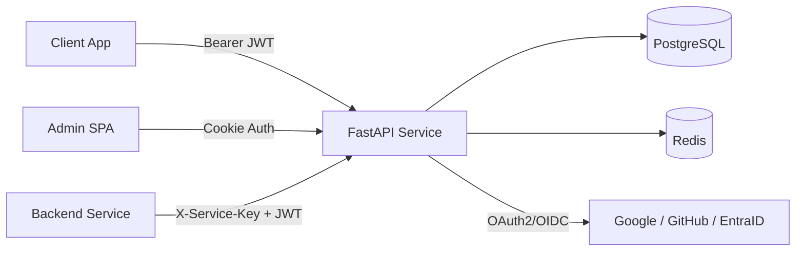
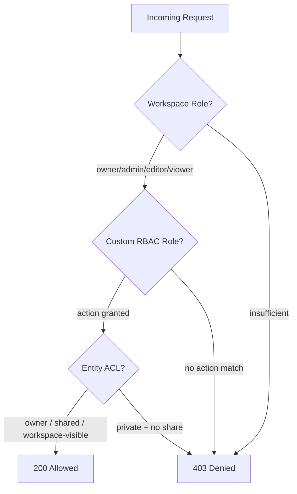

# Sentinel Auth


A lightweight authorization, workspace management, and entity-level permissions service. Built for teams that need batteries-included SSO-first identity with fine-grained authorization. Ships with an Admin UI, Python SDK, and JS/React SDK.

## Status

[](https://github.com/sidxz/Sentinel/actions/workflows/ci.yml)
[](https://sidxz.github.io/Sentinel/)
[](https://pypi.org/project/sentinel-auth-sdk/)
[](https://www.npmjs.com/package/@sentinel-auth/js)
[](https://github.com/sidxz/Sentinel/pkgs/container/sentinel)
[](https://claude.ai/claude-code)
[](https://www.python.org/)
[](https://fastapi.tiangolo.com/)
[](https://www.postgresql.org/)
[](https://redis.io/)

## Capabilities

- **SSO-first authentication** via OAuth2/OIDC with PKCE (Google, GitHub, Microsoft EntraID, any OIDC provider).
- **Three-tier authorization** — workspace roles (JWT claims), custom RBAC roles (DB), and entity ACLs (Zanzibar-style).
- **Token lifecycle** with RS256 JWTs, refresh rotation, reuse detection, and Redis denylist revocation.
- **Workspace isolation** — users, groups, roles, and permissions are scoped per workspace.
- **Admin panel** — React SPA with full CRUD, audit logs, CSV import/export, and role management.
- **Python SDK** — pip-installable `sentinel-auth-sdk` with middleware, FastAPI dependencies, and HTTP clients.
- **JS/React SDK** — `@sentinel-auth/js`, `@sentinel-auth/react`, and `@sentinel-auth/nextjs` on npm. PKCE auth flow, token management, auth-aware fetch, React hooks, and Next.js Edge Middleware.
- **Client & service app management** — register frontend apps (redirect URI allowlist) and backend services (API keys) via the admin panel.
- **JWKS endpoint** — `/.well-known/jwks.json` for automatic key discovery by consuming services.
- **Security hardened** — rate limiting, CORS, HSTS, CSP, trusted hosts, session encryption, and a comprehensive pentest suite.

> **BETA SOFTWARE WARNING**  
> This software is currently in beta and **not fully production ready**. While functional and actively developed, it may contain bugs, incomplete features, or breaking changes. Use in production environments at your own risk. Contributions and feedback are welcome!


## Documentation

Full documentation at [docs.sentinel-auth.com](https://docs.sentinel-auth.com)

## Architecture at a glance



## Authorization model



| Tier | Mechanism | Granularity | Example |
|------|-----------|-------------|---------|
| **Workspace Roles** | JWT claims | Coarse | "Is user an editor in this workspace?" |
| **Custom RBAC** | DB roles + actions | Action-level | "Can user export reports?" |
| **Entity ACLs** | Zanzibar-style DB | Per-resource | "Can user edit document X?" |

## Quick start

### From source

```bash
git clone <repo-url> identity-service && cd identity-service
make setup    # generates JWT keys, TLS certs, env files (random secrets), installs deps, starts Postgres + Redis
```

`make setup` is idempotent — safe to re-run. Once complete, configure an OAuth provider:

```bash
vim service/.env    # add GOOGLE_CLIENT_ID, GOOGLE_CLIENT_SECRET (or GitHub/EntraID), ADMIN_EMAILS
```

Then start the service and admin panel:

```bash
make start    # identity service on :9003 (auto-migrates DB on boot)
make admin    # admin panel on :9004
make seed     # (optional) populate test data
```

### Docker production

```bash
make setup              # generates keys, TLS certs, .env.prod with random DB/Redis passwords
vim .env.prod           # set BASE_URL, ADMIN_URL, OAuth creds, ADMIN_EMAILS
docker compose -f docker-compose.prod.yml up -d
```

### Available commands

Run `make help` to see all commands:

| Command | Description |
|---------|-------------|
| `make setup` | One-time setup: keys, TLS certs, env files, deps, dev containers |
| `make start` | Start identity service on `:9003` (auto-migrates) |
| `make admin` | Start admin panel dev server on `:9004` |
| `make seed` | Seed database with test data |
| `make status` | Check what's running |
| `make lint` | Run ruff linter and format check |
| `make fmt` | Auto-fix lint and formatting issues |
| `make docs-serve` | Serve documentation site with live reload |
| `make pentest` | Run full pentest suite |
| `make clean` | Stop containers and wipe database |
| `make nuke` | Full reset: wipe everything including deps, keys, and env files |
| `make release VERSION=x.y.z` | Release all packages |

### Next steps

1. Sign in to the **admin panel** (`http://localhost:9004`) — your `ADMIN_EMAILS` user is auto-promoted on first login.
2. Register a **client app** (redirect URI allowlist for your frontend).
3. Register a **service app** (API key for your backend).
4. Integrate using the [Python SDK](#python) or [JS/React SDK](#javascript--react).

See the [Getting Started guide](https://sidxz.github.io/Sentinel/getting-started/) for the full walkthrough, or the [Next.js Tutorial](https://sidxz.github.io/Sentinel/guide/tutorial-nextjs/) for a Next.js App Router integration.

## SDK usage

### Python

```bash
pip install sentinel-auth-sdk
```

The `Sentinel` class is the single entry point — it wires up JWT middleware, RBAC action registration, permission and role clients, and a lifespan handler in one object:

```python
from fastapi import FastAPI, Depends
from sentinel_auth import Sentinel, AuthenticatedUser
from sentinel_auth.dependencies import get_current_user, require_role

sentinel = Sentinel(
    base_url="http://localhost:9003",
    service_name="my-service",
    service_key="sk_...",
    actions=[
        {"action": "reports:export", "description": "Export reports as CSV"},
    ],
)

app = FastAPI(lifespan=sentinel.lifespan)
sentinel.protect(app)

# Tier 1: Workspace role from JWT
@app.get("/things")
async def list_things(user: AuthenticatedUser = Depends(get_current_user)):
    return await fetch_things(workspace_id=user.workspace_id)

# Tier 1: Minimum role enforcement
@app.post("/things")
async def create_thing(user: AuthenticatedUser = Depends(require_role("editor"))):
    ...

# Tier 2: Custom RBAC action
@app.get("/reports/export")
async def export(user: AuthenticatedUser = Depends(sentinel.require_action("reports:export"))):
    ...

# Tier 3: Entity-level permission check
@app.get("/things/{thing_id}")
async def get_thing(thing_id: str, user: AuthenticatedUser = Depends(get_current_user)):
    allowed = await sentinel.permissions.can(
        token=request.headers["Authorization"].removeprefix("Bearer "),
        resource_type="thing",
        resource_id=thing_id,
        action="view",
    )
    ...
```

On startup, `sentinel.lifespan` registers your RBAC actions with the identity service. `sentinel.protect(app)` adds JWT middleware with automatic JWKS discovery. `sentinel.permissions` and `sentinel.roles` are lazily-created HTTP clients for the permission and role APIs.

### JavaScript / React

```bash
npm install @sentinel-auth/js @sentinel-auth/react
```

```tsx
import { SentinelAuth } from "@sentinel-auth/js";
import { SentinelAuthProvider, AuthGuard, useAuth, useUser } from "@sentinel-auth/react";

// Initialize the client
const client = new SentinelAuth({ sentinelUrl: "http://localhost:9003" });

// Wrap your app
<SentinelAuthProvider client={client}>
  <AuthGuard fallback={<Login />}>
    <App />
  </AuthGuard>
</SentinelAuthProvider>

// Use hooks in components
function Login() {
  const { login } = useAuth();
  return <button onClick={() => login("google")}>Sign in</button>;
}

function Profile() {
  const user = useUser();
  return <p>{user.name} ({user.workspaceRole})</p>;
}
```

PKCE, token storage, automatic refresh, and auth-aware fetch are handled by the SDK.

## Project structure

```
identity-service/
├── service/              # FastAPI microservice (auth, users, workspaces, permissions, RBAC)
├── sdk/                  # Python SDK (middleware, dependencies, HTTP clients)
├── sdks/                 # JS/TS SDKs (js, react, nextjs packages)
├── admin/                # React admin panel (Vite + TailwindCSS)
├── demo/                 # Demo app — Team Notes (FastAPI backend + React frontend)
├── pentest/              # Security testing suite (ZAP, Nuclei, Nikto, jwt_tool + 110 custom tests)
├── docs/                 # Documentation site (MkDocs Material)
├── docker-compose.yml    # Dev infrastructure (PostgreSQL 16 + Redis 7)
├── docker-compose.prod.yml  # Production stack (Sentinel + PostgreSQL + Redis)
└── Makefile              # setup, start, admin, seed, pentest, docs
```

## Security

The service ships with defense-in-depth middleware, per-endpoint rate limiting, and a comprehensive penetration testing suite. See the [security documentation](https://sidxz.github.io/Sentinel/security/) for the full architecture.

```bash
# Run the pentest suite
make pentest-setup    # install tools (one-time)
make pentest          # ZAP + Nuclei + Nikto + jwt_tool + custom scripts
```

## License

MIT
