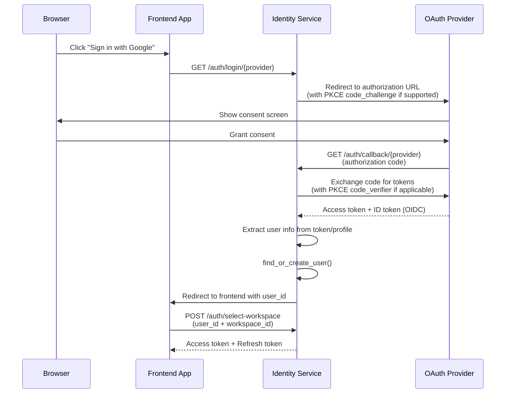

# Authentication

The Sentinel Auth does not manage local user credentials. Users always authenticate through external identity providers (IdPs) via OAuth2 or OpenID Connect. The service acts as an OAuth2 client, handling the redirect flow, extracting user information from the provider, and issuing its own JWT tokens.

## Login Flow



## Supported Providers

| Provider | Protocol | PKCE | Scopes | Notes |
|----------|----------|------|--------|-------|
| Google | OIDC | S256 | `openid email profile` | Full OIDC with discovery endpoint |
| GitHub | OAuth2 | None | `user:email` | Not full OIDC; user info fetched via API |
| Microsoft Entra ID | OIDC | S256 | `openid email profile` | Tenant-specific discovery endpoint |

### Google

Google uses standard OpenID Connect with automatic discovery via `https://accounts.google.com/.well-known/openid-configuration`. PKCE with S256 code challenge is enabled for enhanced security.

```
Required environment variables:
  GOOGLE_CLIENT_ID=your-client-id
  GOOGLE_CLIENT_SECRET=your-client-secret
```

### GitHub

GitHub supports OAuth2 but not OpenID Connect or PKCE. After the code exchange, user profile data is fetched via the GitHub REST API (`GET /user`). If the primary email is not included in the profile response, the service fetches it from the `GET /user/emails` endpoint.

```
Required environment variables:
  GITHUB_CLIENT_ID=your-client-id
  GITHUB_CLIENT_SECRET=your-client-secret
```

### Microsoft Entra ID

Entra ID (formerly Azure AD) uses OIDC with a tenant-specific discovery endpoint. PKCE with S256 is enabled. The tenant ID determines which directory users can authenticate against.

```
Required environment variables:
  ENTRA_CLIENT_ID=your-client-id
  ENTRA_CLIENT_SECRET=your-client-secret
  ENTRA_TENANT_ID=your-tenant-id
```

## Provider Registration

Providers are registered at startup using Authlib's `OAuth` class in `providers.py`. Registration is conditional -- if the environment variables for a provider are not set, that provider is not registered and will not appear in the `GET /auth/providers` response.

```python
from authlib.integrations.starlette_client import OAuth

oauth = OAuth()

if settings.google_client_id:
    oauth.register(
        name="google",
        client_id=settings.google_client_id,
        client_secret=settings.google_client_secret,
        server_metadata_url="https://accounts.google.com/.well-known/openid-configuration",
        client_kwargs={"scope": "openid email profile"},
        code_challenge_method="S256",
    )
```

The `GET /auth/providers` endpoint returns the list of currently configured providers, allowing the frontend to render only the available login buttons.

## Callback Flow

When the OAuth provider redirects back to `/auth/callback/{provider}`, the service:

1. **Exchanges the authorization code** for an access token (and ID token for OIDC providers) via Authlib's `authorize_access_token()`.

2. **Extracts user information** depending on the provider type:
    - **OIDC providers** (Google, Entra ID): User info is parsed from the ID token's `userinfo` claims (`sub`, `email`, `name`, `picture`).
    - **GitHub**: User info is fetched via the GitHub API (`GET /user`). If the email is not present, a secondary call to `GET /user/emails` retrieves the primary email.

3. **Calls `find_or_create_user()`** which implements the following logic:
    - Look up the `social_accounts` table by `(provider, provider_user_id)`.
    - If found, update the existing user's profile (name, avatar) and return.
    - If not found, check if a user with the same email exists. If so, link the new social account to that user (account linking).
    - If no user exists at all, create a new `User` record and a `SocialAccount` record.
    - If the user's email is in the `ADMIN_EMAILS` configuration, automatically set `is_admin = True`.

4. **Redirects to the frontend** with the user ID, where the user selects a workspace and the frontend requests token issuance.

## Important Design Notes

- **No local passwords**: The service never stores or verifies passwords. All authentication is delegated to external IdPs.
- **Account linking**: If a user signs in with Google and later signs in with GitHub using the same email, both social accounts are linked to the same user record.
- **Rate limiting**: Login and callback endpoints are rate-limited to 10 requests per minute per IP to prevent abuse.
- **Session middleware**: Authlib requires Starlette session middleware for the OAuth state parameter. The session secret is configured via `SESSION_SECRET_KEY`.
