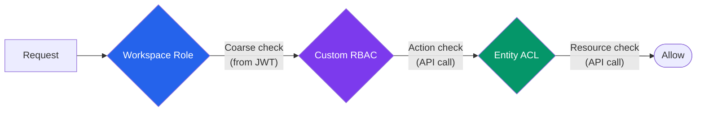

# Authorization

Sentinel provides three tiers of authorization, from coarse to fine-grained.

```python
from sentinel_auth.dependencies import require_role, require_action

# Tier 1 — workspace role from JWT (no API call)
@router.post("/projects")
async def create_project(user=Depends(require_role("editor"))):
    ...

# Tier 2 — RBAC action check (API call to Sentinel)
@router.get("/reports/export")
async def export_report(user=Depends(sentinel.require_action("reports:export"))):
    ...

# Tier 3 — entity ACL check (API call to Sentinel)
@router.get("/documents/{doc_id}")
async def get_document(doc_id: UUID, user=Depends(sentinel.require_user)):
    if not await sentinel.permissions.can(token, "document", doc_id, "view"):
        raise HTTPException(403)
    ...
```

## The Three Tiers

### Tier 1: Workspace Roles

Every user has a role in their active workspace: `owner`, `admin`, `editor`, or `viewer`. The role is embedded in the JWT `wrole` claim, so checks are stateless -- no API call needed.

Use for broad access control: "can this user create resources?" or "can this user manage members?"

See [Workspaces](workspaces.md) for the full role hierarchy and permissions matrix.

### Tier 2: Custom RBAC

Services define application-specific actions (e.g. `reports:export`, `templates:manage`) and organize them into named roles. Users are assigned roles within a workspace. Checks hit the Sentinel API.

Use for action-based authorization: "can this user export reports?" or "can this user approve invoices?"

See [Custom Roles](roles.md) for the full RBAC workflow.

### Tier 3: Entity ACLs

Zanzibar-style per-resource permissions. Resources are registered with Sentinel using a generic `(service_name, resource_type, resource_id)` tuple. Access is controlled through ownership, visibility, and explicit shares to users or groups.

Use for resource-level authorization: "can user X edit document Y?"

See [Entity Permissions](permissions.md) for the resolution algorithm and share types.

## Which Tier Do I Need?

| Question | Tier | Check |
|----------|------|-------|
| Can this user create resources? | Workspace Role | `require_role("editor")` |
| Can this user manage members? | Workspace Role | `require_role("admin")` |
| Can this user export reports? | Custom RBAC | `sentinel.require_action("reports:export")` |
| Can this user approve invoices? | Custom RBAC | `sentinel.require_action("billing:approve")` |
| Can this user view document X? | Entity ACL | `permissions.can(token, "document", doc_id, "view")` |
| Can this user edit project Y? | Entity ACL | `permissions.can(token, "project", proj_id, "edit")` |
| Which documents can this user see? | Entity ACL | `permissions.accessible(token, "document", "view", wid)` |

Most applications use Tier 1 for basic access control and add Tier 2 or Tier 3 as needed. The tiers are independent -- you can use any combination.



## Groups

[Groups](groups.md) are named collections of users within a workspace. They participate in Tier 3 (entity ACLs) -- sharing a resource with a group grants access to all members. Group IDs are embedded in the JWT for fast permission resolution.

## Related

- [Workspaces](workspaces.md) -- workspace roles and member management
- [Custom Roles](roles.md) -- RBAC actions, roles, and assignments
- [Entity Permissions](permissions.md) -- per-resource ACLs and resolution algorithm
- [Groups](groups.md) -- batch permission grants
