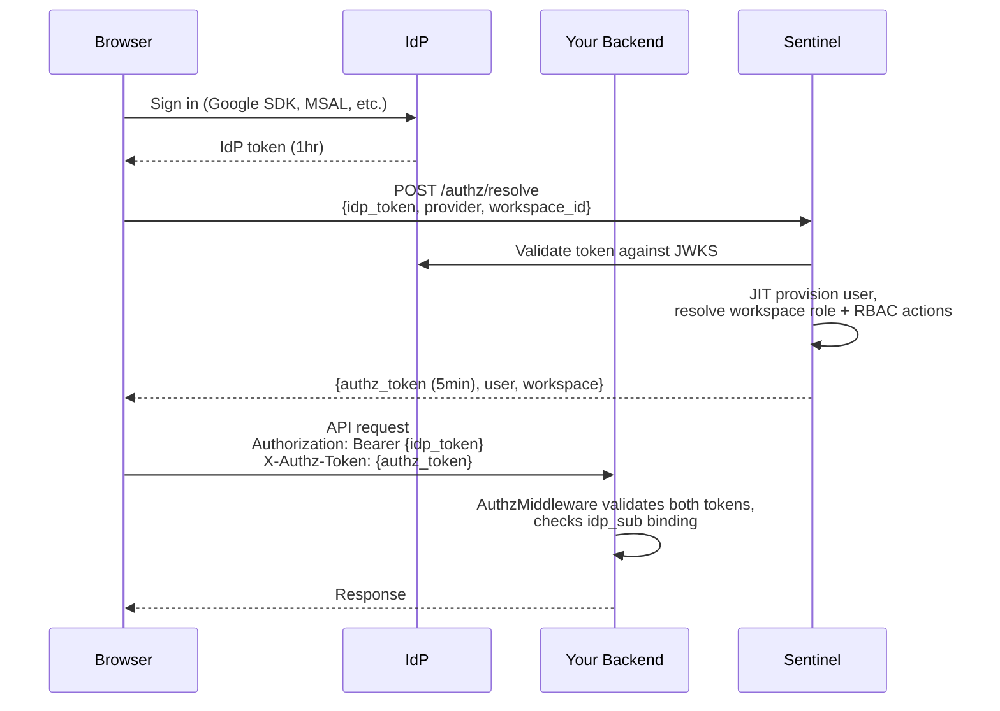
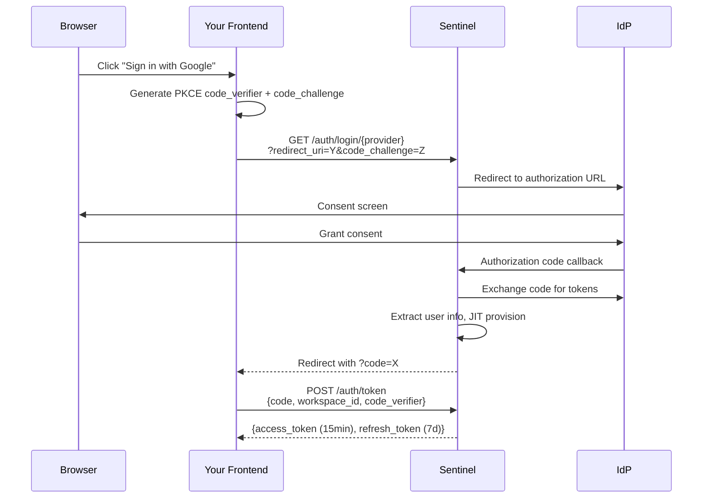

# How Sentinel Works

## What Sentinel Does

Sentinel is an authentication proxy and authorization microservice. It does not store passwords or act as an identity provider -- users always authenticate through external IdPs (Google, GitHub, EntraID). Sentinel validates those IdP credentials, provisions users, and layers on workspace roles, RBAC, and per-resource permissions.

## AuthZ Mode (Recommended)

Your app authenticates users directly with the IdP using its native SDK. Sentinel handles authorization only.

The client sends two tokens on every API request:

- **IdP token** (`Authorization` header) -- proves identity. Issued by Google/GitHub/EntraID, typically valid for 1 hour.
- **Authz token** (`X-Authz-Token` header) -- carries authorization context. Issued by Sentinel, valid for 5 minutes. Contains workspace role, RBAC actions, and an `idp_sub` claim that binds it to the IdP identity.

The backend's `AuthzMiddleware` validates both tokens independently and verifies the `idp_sub` binding -- the IdP token's `sub` must match the authz token's `idp_sub`. This prevents an attacker from pairing a stolen authz token with a different identity.

The authz token also carries an `svc` claim binding it to the requesting service, preventing cross-service replay.

## Proxy Mode

Sentinel handles the entire OAuth2/OIDC flow. The client gets a single JWT.

Sentinel acts as an OAuth2 client, managing the redirect flow, PKCE, and token exchange. Your app receives a single access token containing the user's identity and workspace context. Refresh tokens support silent renewal.

## When to Use Which

| | AuthZ Mode | Proxy Mode |
|---|---|---|
| **IdP login** | Your app handles it | Sentinel handles it |
| **Tokens per request** | 2 (IdP + authz) | 1 (access) |
| **Works with** | Firebase Auth, Supabase Auth, Auth0, any OIDC provider | Google, GitHub, EntraID (configured in Sentinel) |
| **Authz token TTL** | 5 minutes | N/A (15 min access token) |
| **Flexibility** | High -- use any IdP SDK, any login UI | Lower -- Sentinel controls the flow |
| **Best for** | Apps that already have IdP integration | New apps wanting turnkey auth |

## Three-Tier Authorization

Both modes feed into the same authorization system:

1. **Workspace Roles** (JWT claims) -- coarse-grained: `owner`, `admin`, `editor`, `viewer`. Embedded in the token, checked without DB calls. See [Workspaces](workspaces.md).

2. **Custom Roles / RBAC** (DB) -- action-based: "can this user do `reports:export`?" Roles bundle actions; users are assigned roles per workspace. See [Roles](roles.md).

3. **Entity ACLs** (Zanzibar-style, DB) -- per-resource: "can this user edit document X?" Generic `(service_name, resource_type, resource_id)` tuples. See [Permissions](permissions.md).

Each tier is additive. Workspace roles provide the baseline. RBAC adds fine-grained action checks. Entity ACLs add per-object access control.
